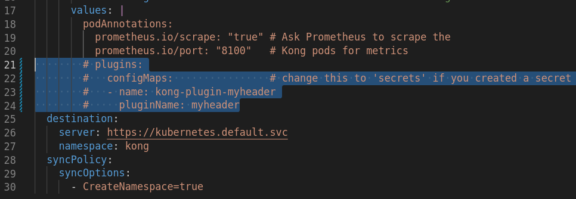

# kind-kong

## Dependencias

- [Docker](https://docs.docker.com/engine/install/)
- [Kind](https://kind.sigs.k8s.io/docs/user/quick-start/#installation)
- [Kubectl](https://kubernetes.io/docs/tasks/tools/)
- [Helm v3](https://helm.sh/docs/intro/install/)


#### Instale kubectl e helm usando asdf

```bash
asdf plugin add kubectl
asdf plugin add helm
asdf install
```

## Configuração Repositorio

Porque neste tutorial usaremos o Argocd, é recomendável [fork] (https://github.com/wendellnet/kind-kong/fork) o projeto original da sua conta pessoal do github.

Depois que o fork for concluído, edite os seguintes arquivos substituindo a variável `repourl` para o seu perfil do GitHub.

```bash
git clone git@github.com:<username>/kind-kong.git

# Edit files
# - config/argocd-foo-bar-app.yaml
# - config/argocd-httpbin-app.yaml

git add config
git commit -m "Atualize repourl para o meu github local"
git push origin main
```

## Crie um cluster Kind

```bash
kind create cluster --name kong --config=resources/kind.yaml
kind get kubeconfig --name kong > ~/.kube/kind-kong-config
```

## Configuração kubectl

```bash
# Configuração kubeconfig
export KUBECONFIG=~/.kube/kind-kong-config

# testando configuração
kubectl get nodes
```

## MetalLB Pool de endereços de configuração usado por LoadBalancers

Para preencher a configuração do Layer2, precisamos fornecer o Metallb uma variedade de endereços IP que ele controla.
Queremos que esse intervalo esteja na rede do tipo Docker.

```bash
docker network inspect -f '{{.IPAM.Config}}' kind
```

Edite o arquivo [argocd-metallb.yaml] (config/argocd-metallb.yaml) adicionando o intervalo IP desejado.


## Configure `/etc/hosts`

> /etc/hosts
```bash
192.168.32.2	httpbin.local
192.168.32.2	grafana.local
192.168.32.2	prometheus.local
192.168.32.2	argocd.local
```

## Instale o ArgoCD

```bash
helm repo add argo https://argoproj.github.io/argo-helm
helm repo update

helm install argo-cd argo/argo-cd --create-namespace --namespace argocd --version 4.5.7 --values resources/argocd-values.yaml

# Check pods
kubectl get pod -n argocd --watch
```

#### Login no argocd

A senha inicial da conta do administrador é gerada automaticamente e armazenada como texto claro na senha de campo em um segredo chamado Argocd-Inial-Admin-secret no espaço para nome de instalação do CD do CD do Argo.

Você pode simplesmente recuperar esta senha usando Kubectl:

```bash
kubectl -n argocd get secret argocd-initial-admin-secret -o jsonpath="{.data.password}" | base64 -d; echo
```
GZ9NvPCcbNXTioKb

#### Encaminhamento de porta

> Em um terminal secundário

```bash
kubectl port-forward service/argo-cd-argocd-server -n argocd 8080:443
```

Vá para a página da web argocd [https: // localhost: 8080] (https: // localhost: 8080) e sincronize o aplicativo argo `app-of-apps`.

## Deploy app of apps

```bash
kubectl -n argocd apply -f resources/argocd-app-of-apps.yaml
```

## Expor argocd com kong

```bash
kubectl -n argocd patch deployment argo-cd-argocd-server --type json -p='[ { "op": "replace", "path":"/spec/template/spec/containers/0/command","value": ["argocd-server","--staticassets","/shared/app","--repo-server","argo-cd-argocd-repo-server:8081","--dex-server","http://argo-cd-argocd-dex-server:5556","--logformat","text","--loglevel","info","--redis","argo-cd-argocd-redis:6379","--insecure"] }]'
```

> Esse comando pode levar algum tempo para recarregar o Pod.

## URLs de serviços

- [argocd](https://argocd.local)
- [httpbin](https://httpbin.local)
- [prometheus](https://prometheus.local)
- [grafana](https://grafana.local)
    - Username: `admin`
    - Password: `kong`

## Implantar plug-ins nativos

```
kubectl apply -n httpbin -f kong-plugins/rate-limiting.yaml
kubectl apply -f kong-plugins/prometheus.yaml
```

## Verificando headers

```bash
curl -I "http://httpbin.local/headers"
```

## Plugin personalizado

O plugin personalizado está localizado na pasta [myheader](myheader).

#### Crie um ConfigMap ou Secret com o código do plugin

Em seguida, vamos criar um ConfigMap ou Secret com base no código do plugin.

Certifique-se de que ele seja criado no mesmo namespace que o Kong está instalado.

```bash
# using ConfigMap; replace `myheader` with the name of your plugin
kubectl create configmap kong-plugin-myheader --from-file=myheader -n kong

# OR using Secret
kubectl create secret generic -n kong kong-plugin-myheader --from-file=myheader
```

#### Instale o plugin Kong

Edite/descomente a configuração de implantação do Kong para instalar o plug-in personalizado em [config/argocd-kong.yaml](config/argocd-kong.yaml)



Adicione, confirme e envie suas alterações para seu repositório git remoto.
```bash
git add config/argocd-kong.yaml
git commit -m "configure myheader custom kong plugin"
git push origin main
```

Em seguida, recarregue a implantação do Kong dentro do ArgoCD.

Aplique o CRD à API do kubernetes.
```bash
kubectl apply -n httpbin -f kong-plugins/custom.yaml
```

## Excluir Kind

```bash
kind delete cluster --name kong
```

## Autor

Managed by [Wendell](https://github.com/wendellnet).

## Licença

Apache 2 Licensed. See [LICENSE](https://github.com/wendellnet/kind-kong/blob/master/LICENSE) for full details.